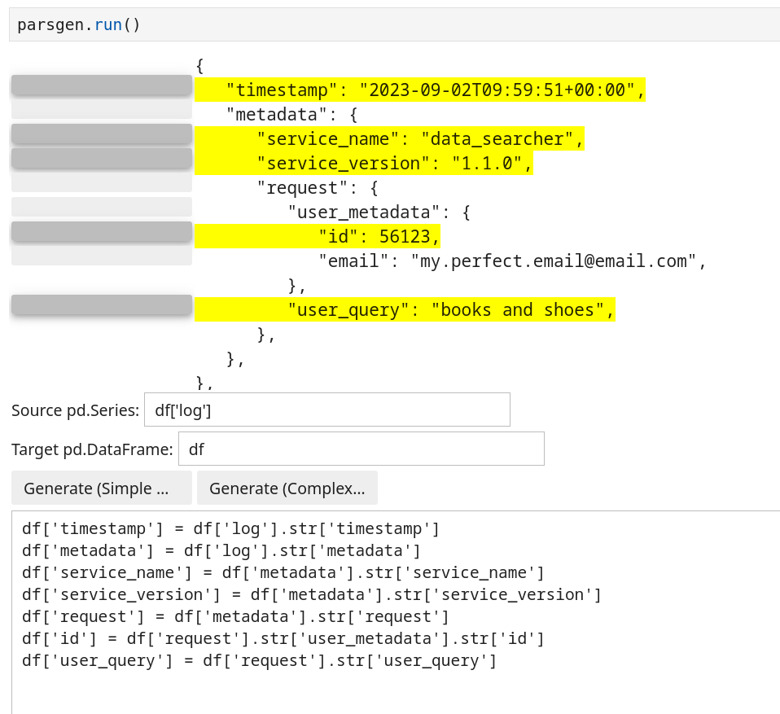
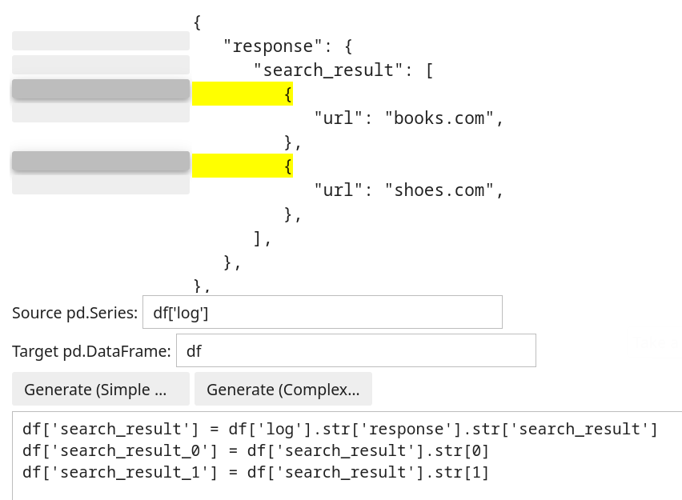

# JSON parser generator for Pandas

This script generates statements for Pandas to extract nested values from JSON objects. It may be used in jupyter notebook and requires ipywidgets to be enabled.

# Installation
To install the script with pip, run  
`pip install git+https://github.com/rerf2010rerf/json_parser_generator.git`

# Usage
```python:
from json_parsgen import json_parsgen
parsgen = json_parsgen.ParserGenerator()
json_obj = {
    'timestamp': '2023-09-02T09:59:51+00:00',
    'metadata': {
        'service_name': 'data_searcher',
        'service_version': '1.1.0',
        'request': {
            'user_metadata': {
                'id': 56123,
                'email': 'my.perfect.email@email.com',
            },
            'user_query': 'books and shoes',
        },
    }
}
parsgen.run(json_obj)
```
After running parsgen.run() you can choose values that you want to extract from the object and click `Generate (Simple Generator)` or  `Generate (Complex Generator)` to generate the extracting value. You can also specify the name of the Pandas series or DataFrame column containing the JSON object and target DataFrame in order to obtain ready-to-use code.


The script supports two generators. 
* The simple generator a generates statement that extracts the full path from the root to the value for each extracting value. For the example above its result would be
```python
df['timestamp'] = df['log'].str['timestamp']
df['service_name'] = df['log'].str['metadata'].str['service_name']
df['service_version'] = df['log'].str['metadata'].str['service_version']
df['id'] = df['log'].str['metadata'].str['request'].str['user_metadata'].str['id']
df['user_query'] = df['log'].str['metadata'].str['request'].str['user_query']
```
* The complex generator extracts intermediate objects if they are in two or more of the full extracting paths. For instance, in the example above, the complex generator extracts objects `metadata` and `request` even though they haven't been chosen.
```python 
df['timestamp'] = df['log'].str['timestamp']
df['metadata'] = df['log'].str['metadata']
df['service_name'] = df['metadata'].str['service_name']
df['service_version'] = df['metadata'].str['service_version']
df['request'] = df['metadata'].str['request']
df['id'] = df['request'].str['user_metadata'].str['id']
df['user_query'] = df['request'].str['user_query']
```

Both the generators also work with lists. In that case, they extract objects from the list by indexes.
